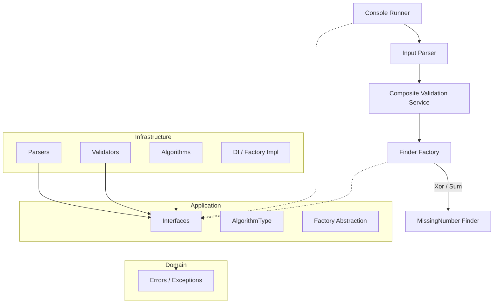

# MissingNumber Project

A sample **Clean Architecture** console application in **C# / .NET 9.0** that finds the missing number in a given array of range `0..n`.

## 🚀 Features
- **Multiple Algorithms** (XOR and Sum) chosen via strategy/factory.
- **Input Validation** (duplicate values, out-of-range values, invalid tokens).
- **Dependency Injection** using `Microsoft.Extensions.DependencyInjection`.
- **Unit & Integration Tests** with xUnit.
- **GitHub Actions CI pipeline** to build and test on push.

## 🛠️ Usage

```bash
# Build solution
dotnet build

# Run console app (default XOR algorithm)
dotnet run --project src/MissingNumber.Console -- "3,0,1"

# Run with Sum algorithm
dotnet run --project src/MissingNumber.Console -- "3,0,1" Sum

# Run tests
dotnet test
```

### Example Output
```bash
Input: 3,0,1
Missing number (Xor): 2
```

## 🧱 Project Structure
```
src/
  MissingNumber.Console        # Entry point (ConsoleRunner, Program)
  MissingNumber.Application    # Interfaces, AlgorithmType
  MissingNumber.Domain         # Domain exceptions
  MissingNumber.Infrastructure # Parsers, Validators, Algorithms, Factory, DI
tests/
  MissingNumber.Application.Tests # Unit + Integration tests
```

## 🧑‍💻 SOLID Principles Applied

- **S**ingle Responsibility:  
  Each validator, parser, and finder has a single concern.

- **O**pen/Closed:  
  New algorithms can be added without modifying existing ones (plug into the factory).

- **L**iskov Substitution:  
  Different `IMissingNumberFinder` implementations can replace each other seamlessly.

- **I**nterface Segregation:  
  Small, focused interfaces (`IInputParser`, `IInputValidator`, `IMissingNumberFinder`).

- **D**ependency Inversion:  
  High-level modules depend on abstractions (interfaces) and use DI to resolve implementations.

## ✅ CI/CD
A GitHub Actions pipeline (`.github/workflows/dotnet.yml`) restores, builds, and tests the solution on every push and PR to `main`.


## 🖼️ Architecture Diagram
```text
     +-------------------+
     |   Console Layer   |
     |-------------------|
     | ConsoleRunner     |
     +---------+---------+
               |
               v
     +-------------------+
     | Infrastructure    |
     |-------------------|
     | Parsers           |
     | Validators        |
     | Algorithms        |
     | Factory, DI       |
     +---------+---------+
               |
               v
     +-------------------+
     |   Application     |
     |-------------------|
     | Interfaces        |
     | AlgorithmType     |
     +---------+---------+
               |
               v
     +-------------------+
     |      Domain       |
     |-------------------|
     | Exceptions        |
     +-------------------+
```


## 📝 Mermaid Architecture Diagram




## 🔖 CI Build Status


